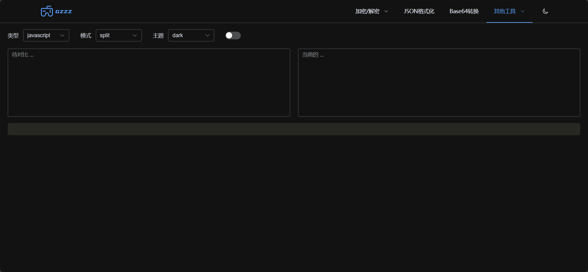

# 在线常用小工具

一个在线小工具，包含SM4、AES等算法加解密、json格式化、base64转换、代码对比等功能。支持明亮、暗黑两种主题，页面美观。
持续开发中，后续功能，敬请期待。

## 项目安装

```bash
npm install
```

### 项目启动

```bash
npm run dev
```

### 项目打包

```bash
npm run build
```




